**Phone ⇄ PC, nothing in between**  
[Aero](https://github.com/HarshalPatel1972/aero): send files, end-to-end encrypted over local Wi-Fi.  
[Rift](https://github.com/HarshalPatel1972/rift): your phone becomes your PC's keyboard, trackpad and screen.  
[Momentum](https://github.com/HarshalPatel1972/momentum): your AI agent asks, you approve from your phone.

**Stays on your machine**  
[Matchstick](https://github.com/HarshalPatel1972/win-light): `Ctrl+Space` to find anything on Windows. [On the Microsoft Store](https://apps.microsoft.com/detail/9PJ64FKJ8C40).  
[Keyflex](https://github.com/HarshalPatel1972/keyflex): learns your shortcuts without ever logging a keystroke.

**You own the server**  
[GoSync](https://github.com/HarshalPatel1972/GoSync): offline-first, real-time sync. One Go binary.  
[Spectra](https://github.com/HarshalPatel1972/spectra): finds the crypto quantum computers will break.

**Merged upstream**  
[gopsutil](https://github.com/shirou/gopsutil/pull/2062): Windows process listing, O(N²) → O(N).  
[containerd](https://github.com/containerd/containerd/pull/13856): fixed a memory leak in the OOM watcher.

[portfolio](https://harshal-patel-chi.vercel.app) · [linkedin](https://www.linkedin.com/in/harshal-patel-59b9a5278/)
